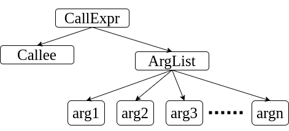
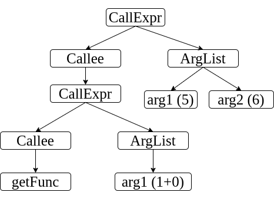

# COMS W4115: Programming Assignment 2.2 (Syntax Analysis)


## Course Summary

Course: COMS 4115 Programming Languages and Translators (Fall 2020)  
Website: https://www.rayb.info/fall2020  
University: Columbia University.  
Instructor: Prof. Baishakhi Ray


## Logistics
* **Announcement Date:** Thursday, October 1, 2020
* **Due Date:** Wednesday, October 14, 2020 by 11:59 PM. **No extensions!**
* **Total Points:** 100

## Grading Breakdown
* **Visualizing and Understanding ASTs:** 10
* **Task 1 (Recursive Functions):** 40
* **Task 2 (Code Reformatting Tool):** 50 

## Assignment Objectives

From this assignment:

1. You **will learn** about the AST structure of the code.
2. You will get familiar with different AST APIs provided by LLVM/Clang. 
3. You will get familiar with Clang's ASTVisitor. 
4. You **will learn** how to traverse an AST. 
5. You **will learn** how to write a simple code reformatter. 

## Assignment

You have already implemented a (albeit very simple) lexical analyzer/tokenizer that converts character sequences from a code stream to token sequences. As you learned in lecture, this token sequence is processed by the parser, and an **abstract syntax tree (AST)** is generated. In this assignment, you will use the `clang` compiler to generate an AST. Further, you will investigate two different case studies to analyze an AST.

### Generating the AST (10 Points)
In Programming Assignment 2.1, you saw how to build LLVM. The Clang compiler front-end leverages the LLVM back-end infrastructure. For any code written in `C`, `C++`, or `Objective-C`, you can generate (and visualize) the AST using Clang.

First, let the shell/terminal know where you built LLVM. We recommend adding the following line to your `$HOME/.bashrc` file:
```sh
export LLVM_HOME=<base directory where you built your llvm>;
```
Next, try the following command:
```sh
$LLVM_HOME/build/bin/clang -cc1 -ast-dump examples/gcd.c -I /usr/include/ \
        -I $LLVM_HOME/build/lib/clang/12.0.0/include/;
```

You should spend some time looking at the output. Please write a few sentences in the [outputs/AST.txt](outputs/AST.txt) file describing the following:
* What information is being presented in the output
* What you find interesting about the output

You can also generate a visual representation of the AST. Try running the following command:
 
```sh
export LLVM_HOME=<base directory where you built your llvm>;
$LLVM_HOME/build/bin/clang -cc1 -ast-view gcd.c -I /usr/include/ \
        -I $LLVM_HOME/build/lib/clang/12.0.0/include/;
```

This will generate a `dot` file in your `/tmp/` directory. Locate the created `dot` file and identify the filename. Run the following: 
```
dot -Tpdf /tmp/<dot file filename> -o output/AstView.pdf
```
Take a look at the PDF file that is generated, and try to match that with the output generated in the previous step. 

### Analyzing the AST

The AST is not just for viewing purposes; there are many powerful things you can do with an AST. For example, you can warn developers when a variable name does not follow a convention (*e.g.*, camel casing) by traversing an AST; if you find or "visit" a variable name, you can verify whether that name matches the intended convention. Otherwise, you can generate a warning.

In this particular assignment, you will investigate how to analyze an AST to extract important information for two different tasks.

### Task 1: Recursive Functions (40 Points)

[Recursive functions](https://en.wikipedia.org/wiki/Recursion_(computer_science)) are often compact, easy to read, and easy to understand. However, they often incur huge overhead due to [call stack](https://en.wikipedia.org/wiki/Call_stack) maintenance, which is a major concern if you are developing for a resource-constrained system. Your task here is to determine whether a given function is [direct recursive](https://www.educative.io/courses/recursion-for-coding-interviews-in-cpp/BnKojpzLl2W) or not. We will describe the tools that you will use for this task in a [later section](#getting-started).

#### Example
```c
1. int recursive_factorial(int n1){
2.     if (n1 <= 1){
3.         return 1;
4.     }
5.     return n1 * recursive_factorial (n1 - 1);
6. }
```
In the above `C` code snippet, the function `recursive_factorial` is a direct recursive function, since there is a call to itself inside the body (line 5). In contrast, the following function is not direct recursive; even though there is a function call at line 4, the callee is not the function itself:
```c
1. int iterative_factorial(int n1){
2.     int res = 1;
3.     for(int i = 0; i <= n3; i++){
4.         res = mult(res, i); // multiplication of res and i.
5.     }
6.     return res;
7. }
``` 

### Task 2: Code Reformatting Tool (50 Points)

We can perform a lot of interesting operations using an AST. In Task 1, you learned how to identify recursive functions. In this task, you will gain some hands-on experience on automatic code formatting by analyzing an AST.

Suppose you have a function call in your code such as the following:
```c
foo( 1,       
        2      , 
3    ,    5)
```
Then, you will need to format it as:
```c
foo (1, 2, 3, 5)
```
More specifically, you will need to format the call expression as `<callee><space>(<arg1>,<space><arg2>,<space>...,<space><argn>)` for all `n` arguments. The `<space>` represents a single space character `' '`. Note that the callee and/or arguments of a function may also be function calls themselves, and you will need to figure out how to reformat those nested function calls whenever they arise.


### Examples
The conceptual AST structure of a `CallExpr` (Function Call Expression) node in an AST looks like this:

<p align="center">  </p>

The `Callee` and any of the arguments (_i.e._, `arg1`, `arg2`, etc.) can also be `CallExpr` nodes. Take a look at the next examples, which illustrate (and explain) this construction.

Note that the following code is very difficult to read:

```c
1. int bar(int k){
2.     foo(
3.   bar ( k 
4. ),
5. 1   );
6.        return 0;
7. }
```

However, when you run your reformatter tool, the function call to `foo` at line 2 should be formatted as:
```c
foo (bar (k), 1)
```
Now, it is definitely much easier to understand the function call!

**Explanation:** in the function call at line 2, the callee is a function named `foo`, which takes in two arguments. One of the arguments (the first one) is also a function call that invokes `bar` with the argument `k`. The function call to `bar` is formatted as `bar (k)`, which contributes to the original `foo` function call's formatting. Hence, the whole function call is reformatted as `foo (bar (k), 1)`.


Here is another example:
```c
 1. typedef int (*FuncPtr)(int, int);
 2. 
 3. int addNum(int a, int b) {
 4.     return a + b;
 5. }
 6.
 7. int mulNum(int a, int b) {
 8.   return a * b;
 9. }
10.
11. FuncPtr getFunc(int op) {
12.     return op == 1 ? &addNum :
13.           op == 2 ? &mulNum :
14.           (FuncPtr)0;
15. }
16.
17. int main() {
18.     int ret = getFunc( 
19.           1+0   )(  5 , 6   );
20.     return 0;
21. }
```
The reformatted code that you should generate is:
```c
getFunc (1+0) (5, 6)
```

**Explanation:** in line 18 of the above code, there is a function call. It is slightly more complicated than the one in the previous example.

<p align="center">  </p>

Here, the `Callee` is not a function name; rather, it is another function call (a `CallExpr` node) to `getFunc`, which takes in one argument. Thus, we reformat the `Callee` to `getFunc (1+0)`, and we finally get the formatted output `getFunc (1+0) (5, 6)`.


## Getting Started
To implement the above two tasks, you will build a [Clang tool](https://clang.llvm.org/docs/LibTooling.html) that uses LLVM/Clang's [RecursiveASTVisitor API](https://clang.llvm.org/doxygen/classclang_1_1RecursiveASTVisitor.html). We have provided all the setup code to get started. However, we strongly recommend that you go over the API documentation of Clang tooling and AST visitors to understand the basic workflow.
 
### Steps
1. Create a folder named `clang-hw2` under `$LLVM_HOME/clang/tools`.
2. Copy the [ClangHw2.cpp](src/ClangHw2.cpp), [CMakeLists.txt](src/CMakeLists.txt), [hw2_util.h](src/hw2_util.h), and [hw2_util.cpp](src/hw2_util.cpp) files into 
`$LLVM_HOME/clang/tools/clang-hw2`.
3. Edit the `$LLVM_HOME/clang/tools/CmakeLists.txt` file, and add this line: `add_clang_subdirectory(clang-hw2)`. 
4. Now, go to `$LLVM_HOME/build`, and run `make`. When the build has successfully finished, it will generate a binary file named `clang-hw2` in `$LLVM_HOME/build/bin`. 
5. Finally, run the generated binary using the following command: `$LLVM_HOME/build/bin/clang-hw2 examples/gcd.c --`

### About the Code

The [`FunctionVisitor`](src/ClangHw2.cpp#L26) class is a recursive AST visitor, which implements three visitors for two different types of AST nodes. The [`VisitForStmt`](src/ClangHw2.cpp#L120) is called when Clang's ASTVisitor encounters a [`ForStmt`](https://clang.llvm.org/doxygen/classclang_1_1ForStmt.html) type of AST node. You **DO NOT** have to do anything with this function; we are providing it to give you a head start with ASTVisitor. The [`VisitFunctionDecl`](src/ClangHw2.cpp#L99) function is called when a `FunctionDecl` (function declaration) node is encountered. 

Here are some other notes about the tasks:
#### Task 1 
We implemented [`VisitFunctionDecl`](src/ClangHw2.cpp#L99), which calls the helper function [`isRecursiveFunction`](src/ClangHw2.cpp#L54) and decides whether that function is direct recursive or not. **All you have to do is implement this `isRecursiveFunction` function**.

You may consider the following constraint for Task 1:

* We will only test C code inputs. You **DO NOT** need to handle function calls in C++ or C++-specific functionality (including operator overloading or user-defined literals, etc.).

When you have fully implemented the first task and have run the tool with [`gcd.c`](examples/gcd.c), you will see the following output:
```
gcd_recursive - recursive
```

#### Task 2 
From the `VisitFunctionDecl` function, we call [`analyzeCallExpressionReformat`](src/ClangHw2.cpp#L68) to perform a [depth-first search (DFS)](https://en.wikipedia.org/wiki/Depth-first_search) on the AST. While performing DFS, if we encounter any [`CallExpr`](https://clang.llvm.org/doxygen/classclang_1_1CallExpr.html) node, we call the [`formatFunctionCall`](src/ClangHw2.cpp#L61) function for formatting the code of that call expression. Note that, you **DON'T** have to identify call expressions in a given code snippet. We have already implemented that for you in [this function](src/ClangHw2.cpp#L68). **All you have to do is implement the [`formatFunctionCall`](src/ClangHw2.cpp#L61) function and return the formatted code string.**

You may consider the following constraints for Task 2:
* You have to reformat only the `CallExpr` node. If you encounter any other node (for instance, `1+0 ` in line 19 of the second example is a [`BinaryOperator node`](https://clang.llvm.org/doxygen/classclang_1_1BinaryOperator.html)), you should copy the code as is from the input source. We have provided a helper function [`getSource`](src/ClangHw2.cpp#L41) to copy the input code corresponding to a node.
* The callee or arguments of a function call will be either a pure function call or a pure non-function call, *i.e.*, there will not be a mixture of functions and non-functions involved in binary expressions, conditional expressions, etc. As an example, we will **NOT** test the following case:
```c
foo(bar(3) + 1, 9 + bar(6))
```
* We will only test C code inputs. You **DO NOT** need to handle function calls in C++ or C++-specific functionality (including operator overloading or user-defined literals, etc.).
* This problem may look like a simple character _"parsing and formatting"_ problem, but you **MUST** use the template code we provided. Please **DO NOT** change function prototypes of any of the functions we have written.

We have also provided some other helper functions.


## Submission

Please follow these steps for submission:

1. Copy the completed `ClangHw2.cpp` file from your `$LLVM_HOME/clang/tools/clang-hw2/` directory to the project's `src` folder. 
2. Complete the write-up in [outputs/AST.txt](outputs/AST.txt). 
3. Commit your code.
4. Push the code to the master branch.

## Piazza
If you have any questions about this programming assignment, please post them in the Piazza forum for the course, and an instructor will reply to them as soon as possible. Any updates to the assignment itself will be available in Piazza.


## Disclaimer
This assignment belongs to Columbia University. It may be freely used for educational purposes.
